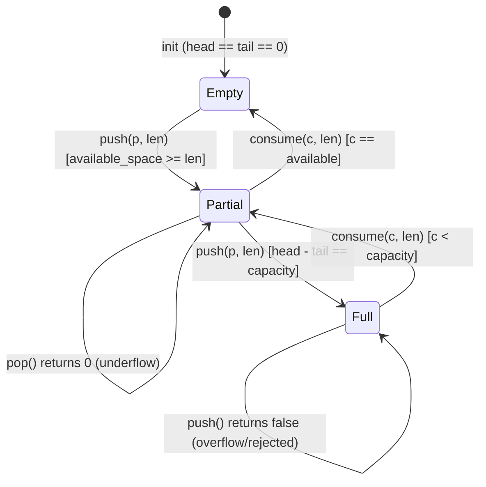

# First Principles: Lock-Free Single-Producer-Single-Consumer Queue

## 1. Why Lock-Free?

A `std::mutex` protects shared state by blocking competing threads. In a high-throughput SDR pipeline, blocking the USB ingest thread for even a few microseconds drops RF samples permanently (the RF signal does not wait). A lock-free SPSC (Single Producer, Single Consumer) queue eliminates blocking: the producer pushes without waiting for the consumer, and the consumer pops without blocking the producer.

Trade-off: Lock-free structures are more complex to design correctly (memory ordering, wrap-around arithmetic, false sharing), but provide deterministic latency — critical for real-time signal processing.

## 2. Memory Ordering (`std::memory_order`)

`std::atomic<size_t>` provides four ordering levels. Understanding each is essential for correctness:

| Order | Behavior | Use in Ring Buffer |
|---|---|---|
| `relaxed` | No synchronization; fastest; no visibility guarantees. | Not used for head/tail (would allow reading partially written samples). |
| `release` | All writes before the store are visible to threads that `acquire`. | Producer stores `head` after pushing data (`m_head.store(new_head, release)`). |
| `acquire` | Reads after the load see all writes from the releasing thread. | Consumer loads `head` before reading data (`head.load(acquire)`). |
| `seq_cst` | Total order across all threads; slowest. | Not needed for SPSC (only two threads, directional dependency). |

The contract is directional:
- Producer: write data into array → `head.store(new, release)`.
- Consumer: `head.load(acquire)` → read data from array → process → `tail.store(new, release)`.

This guarantees the consumer never sees a `head` value that points to partially written data. The `tail` update uses `release` so the producer sees consumed space.

Reference (`src/buffer/SpscRingBuffer.cpp`):

```cpp
// Producer
m_head.store(head + len, std::memory_order_release);

// Consumer
size_t head = m_head.load(std::memory_order_acquire);
```

## 3. False Sharing and Cache Alignment

Modern CPUs load memory in 64-byte cache lines. If `head` and `tail` atomics reside in the same cache line (or adjacent ones that share a line), updates to one invalidate the entire line in the other CPU core. This is `false sharing`: no true data dependency exists, yet performance collapses because both threads constantly flush each other's caches.

Solution: Pad `head` and `tail` to separate 64-byte-aligned memory regions:

```cpp
alignas(64) std::atomic<size_t> m_head{0};
alignas(64) std::atomic<size_t> m_tail{0};
```

This ensures updates to `head` never evict `tail` from the L1/L2 cache, maintaining throughput.

## 4. Bitmask Wrap-Around (Power-of-Two Capacity)

The ring buffer capacity is a power of two (`2^n`). Array indexing uses bitmask (`index & (cap - 1)`) instead of modulo (`% cap`). Why?

- Modulo (`%`) is a division instruction — slow on embedded CPUs.
- Bitmask (`&`) is a single bitwise AND — one CPU cycle.

For capacity `1024` (`2^10`):
- Mask = `1023` (`0b1111111111`)
- Index `1024` → `1024 & 1023 = 0` (wraps cleanly)
- Index `2047` → `2047 & 1023 = 1023` (last slot)

This requires capacity to always be `2^n`; non-power capacities fall back to modulo arithmetic (slower) or are rejected by the constructor (`if (n & (n - 1)) throw`).

Reference (`include/buffer/SpscRingBuffer.hpp`):

```cpp
bool is_power_of_two(size_t n) const { return (n & (n - 1)) == 0; }
size_t capacity_mask() const { return m_capacity - 1; }
```

## 5. Zero-Copy Contract (`pop` / `consume`)

Instead of copying samples out of the ring buffer (which requires a temporary buffer and extra memory bandwidth), the design provides zero-copy access:

```cpp
size_t pop(T*& buffer_ref);  // Returns pointer to internal array
void consume(size_t len);    // Advances tail after reading
```

The caller receives `buffer_ref` (a pointer into the ring buffer's internal storage), reads `len` samples, then calls `consume(len)` to release the space. This eliminates heap allocations and memory copies on the hot path — essential for high sample rates (`2+ MHz` IQ streams).

**Chunking asymmetry (as implemented):** writes are all-or-nothing — `push()` rejects a chunk that would overflow *or* split across the wrap boundary — while reads are naturally chunked: `pop()` returns `min(available, capacity - tail_index)`, i.e., the contiguous run up to the end of storage. A producer whose chunks exceed remaining end-of-buffer space will see rejections until the consumer drains past the boundary; size ingress chunks well below capacity, or retry.

Other contract corners: `push()` with `len == 0` or `len > capacity` returns `false`; empty `pop()` returns 0 and sets `buffer_ref = nullptr`; `consume()` must be called at most once per `pop()` with `len <=` the returned count; the template is explicitly instantiated for `std::complex<float>` only (`src/buffer/SpscRingBuffer.cpp`).

## 6. Overflow Behavior (Backpressure)

The `push()` method returns `false` if the ring buffer is full (`head - tail >= capacity`). There is no blocking: the caller (ingress thread) must decide on backpressure — either drop the chunk or retry. This is an explicit design choice: blocking the USB thread would lose RF samples anyway, so non-blocking with caller-controlled retry/drop is more appropriate for real-time systems.

Reference (`src/buffer/SpscRingBuffer.cpp`):

```cpp
bool SpscRingBuffer<T>::push(const T* data, size_t len) {
    size_t head = m_head.load(std::memory_order_relaxed);
    size_t tail = m_tail.load(std::memory_order_acquire);
    if (head - tail >= m_capacity) return false; // Full
    ...
}
```

## 7. State Machine



## 8. Performance Constraints (LLD Reference)

- Zero heap allocations per sample in hot path (`push` / `pop`).
- Memory footprint target: `< 64 MB` (buffer + taps + plugins).
- Capacity must be a multiple of SIMD lane width (4 or 8 complex samples) for efficient DSP processing.
