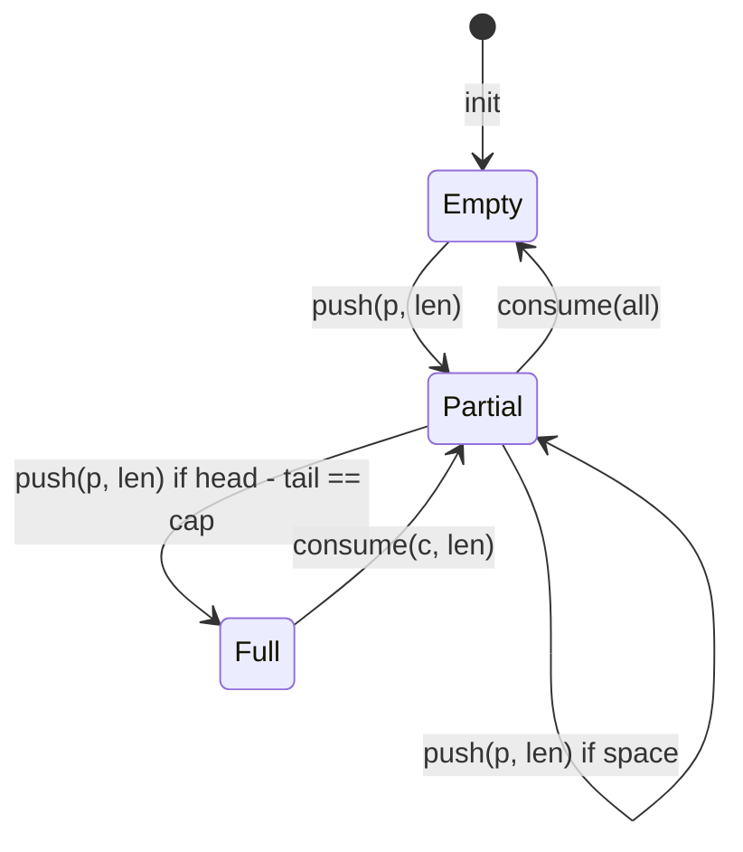

# First Principles: Lock-Free Ring Buffer (SPSC)

## Why Lock-Free?

A mutex (`std::mutex`) protects shared state by blocking threads. In a high-throughput SDR pipeline, blocking the USB ingest thread for even microseconds drops RF samples. A lock-free SPSC (Single Producer, Single Consumer) queue eliminates blocking entirely: the producer never waits on the consumer, and vice versa.

## Memory Ordering

`std::atomic<size_t>` provides four memory orders:

- `memory_order_relaxed`: No synchronization guarantees; fastest.
- `memory_order_release`: All writes before the store are visible to threads that acquire.
- `memory_order_acquire`: Reads after the load see all writes from the releasing thread.
- `memory_order_seq_cst`: Strongest; total order across all threads (slower).

For the ring buffer:
- Producer (`push`) writes data, then updates `head` with `release`.
- Consumer (`pop`) reads `head` with `acquire`, then reads data safely.

This guarantees the consumer sees fully written data, not partially written samples.

## False Sharing & Cache Lines

Modern CPUs load memory in 64-byte cache lines. If `head` and `tail` atomics share a cache line, updates to one invalidate the line in the other CPU core, causing performance collapse (`false sharing`). The design pads `head` and `tail` to separate `alignas(64)` cache lines.

## Bitmask Wrap-Around

Capacity is a power of two (`2^n`). Array indexing uses bitmask (`index & (cap - 1)`) instead of modulo (`% cap`), which is faster and avoids division instructions in the hot loop.

