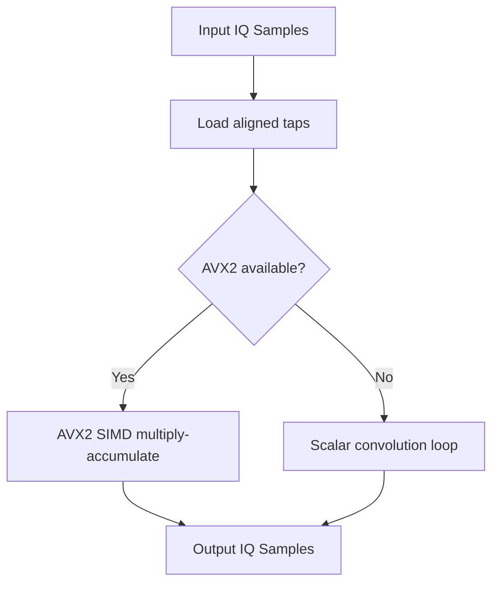

# First Principles: FIR Filter & SIMD

## Convolution

A Finite Impulse Response (FIR) filter computes output `y[n]` as the convolution of input `x[n]` with filter taps `h[k]`:

```
y[n] = sum(k=0..M-1) h[k] * x[n - k]
```

Where `M` is the tap count. Each output sample depends on the current and previous `M-1` input samples. This is a sliding-window weighted average.

## Scalar vs SIMD

A scalar loop computes one `y[n]` at a time. SIMD (AVX2) computes multiple `y[n]` in parallel using 256-bit registers (`__m256`) that hold 8 floats or 4 complex pairs. To use SIMD safely:

- Tap arrays must be 32-byte aligned (`alignas(32)`).
- Input length should be a multiple of the SIMD lane width (4 or 8 complex samples).
- Unaligned input requires scalar fallback or unaligned load instructions (`loadu`).

The `FirFilterSimd` class is guarded by `#ifdef __AVX2__`; on non-AVX platforms, the scalar `FirFilter` is used.


