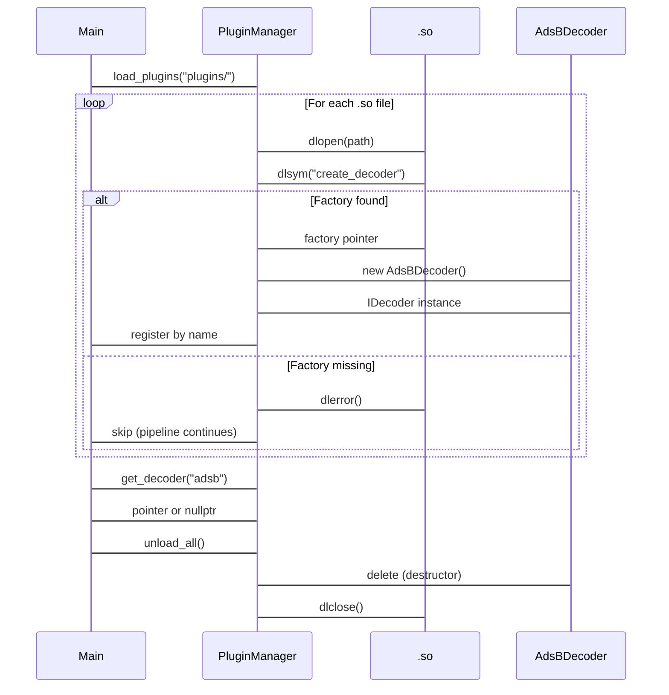

# First Principles: Runtime Plugin Loading (`dlopen` / `dlsym`)

## 1. Dynamic Linking Fundamentals

Static linking embeds library code into the executable at compile time. Dynamic linking loads `.so` (Shared Object, Linux/macOS) or `.dylib` (Dynamic Library, macOS) files at runtime. This allows new protocol decoders to be added without recompiling the main `sdr_main` executable — critical for field-upgradable SDR systems.

## 2. `dlopen()` and `dlsym()`

- `dlopen(path, flags)` loads a `.so` into the process address space and returns an opaque handle (`void*`).
  - `RTLD_NOW`: Resolve all symbols immediately (fails fast if factory is missing).
  - `RTLD_LAZY`: Resolve symbols on first use (slightly faster load, deferred failure).
- `dlsym(handle, symbol_name)` retrieves the address of an exported symbol (function or variable) by name.
- `dlclose(handle)` unloads the library when no longer needed.

If `dlopen()` fails, `dlerror()` returns a human-readable error string (e.g., missing symbol, architecture mismatch). The `PluginManager` logs these errors and continues (does not abort the pipeline).

Reference (`src/core/PluginManager.cpp`):

```cpp
void* handle = dlopen(full_path.c_str(), RTLD_NOW);
if (!handle) {
    std::cerr << "PluginManager: dlopen failed: " << dlerror() << std::endl;
    continue;
}
```

## 3. Factory Pattern and `extern "C"`

C++ name mangling (encoding parameter types into symbol names) makes `dlsym()` unreliable for C++ classes. The design requires plugins to export a C-linkage factory function:

```cpp
extern "C" IDecoder* create_decoder() {
    return new AdsBDecoder();
}
```

Without `extern "C"`, the compiler would mangle the name (e.g., `_Z17create_decoderv`), making `dlsym` lookup fail. The factory returns a pointer to the abstract base (`IDecoder*`), which the manager stores in a `std::unique_ptr<IDecoder>`. The concrete class (`AdsBDecoder`) is never directly known to the manager; it only interacts through the interface.

## 4. Interface Contract (`IDecoder`)

Every decoder must implement:

```cpp
class IDecoder {
public:
    virtual std::string get_name() const = 0;
    virtual void accept_samples(const std::complex<float>* data, size_t len) = 0;
    virtual ~IDecoder() = default;
};
```

- `get_name()` provides the lookup key (`m_decoders[name]`).
- `accept_samples()` receives normalized float IQ arrays from the DSP thread. It must not block or allocate excessively, since it runs in the hot data path.
- The destructor is virtual to ensure proper `delete` through the base pointer.

## 5. Plugin Lifecycle



The manager owns all decoder instances; the main pipeline never deletes them directly. `unload_all()` is called by the `PluginManager` destructor or explicitly before shutdown.

## 6. Thread Safety Constraints

- `load_plugins()` and `unload_all()` are called only from the main/orchestrator thread (`Orchestrator::start()` / `~Orchestrator()`).
- `get_decoder()` is called from the DSP thread (`Orchestrator::dsp_loop()`), but only reads the `std::map` (no insertion/deletion during read). If future versions allow dynamic reload during operation, a reader-writer lock (`std::shared_mutex`) would be required.
- The plugin's `accept_samples()` runs in the DSP thread; it must not call `load_plugins()` or `unload_all()` (would cause deadlock or use-after-free).

## 7. Security Considerations

Loading arbitrary `.so` files introduces a security risk: a malicious plugin could execute arbitrary code (`create_decoder()` can run any constructor logic before returning). In production, plugins should be signed or restricted to a known directory with strict file permissions (`chmod 755`, owned by a non-root user). The current design does not implement sandboxing; it relies on the plugin directory being protected by the host system.
