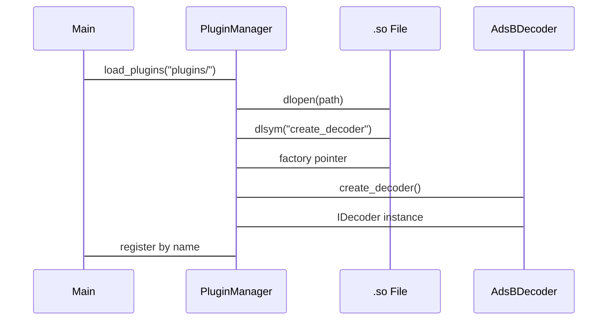

# First Principles: Plugin Architecture (`dlopen`)

## Dynamic Linking

Static linking binds libraries at compile time. Dynamic linking (`dlopen`) loads `.so` (Linux) or `.dylib` (macOS) files at runtime, allowing new protocol decoders without recompiling the main executable.

## Factory Pattern

The pipeline does not know the concrete decoder class at compile time. Instead, each plugin exports a C-linkage factory function:

```cpp
extern "C" IDecoder* create_decoder() {
    return new AdsBDecoder();
}
```

`PluginManager` calls `dlsym(handle, "create_decoder")` to retrieve the factory pointer, then invokes it to get an `IDecoder*`. The manager owns the instance (`std::unique_ptr<IDecoder>`) and releases it on `unload_all()` by calling `dlclose()`.

## Lifecycle Contract

- Load: `dlopen()` -> `dlsym()` -> instantiate -> register by `get_name()`.
- Unload: `unload_all()` destroys decoder instances, then `dlclose()` handles.
- Thread safety: Load/unload is called from the main/orchestrator thread only, never from the hot DSP thread.


