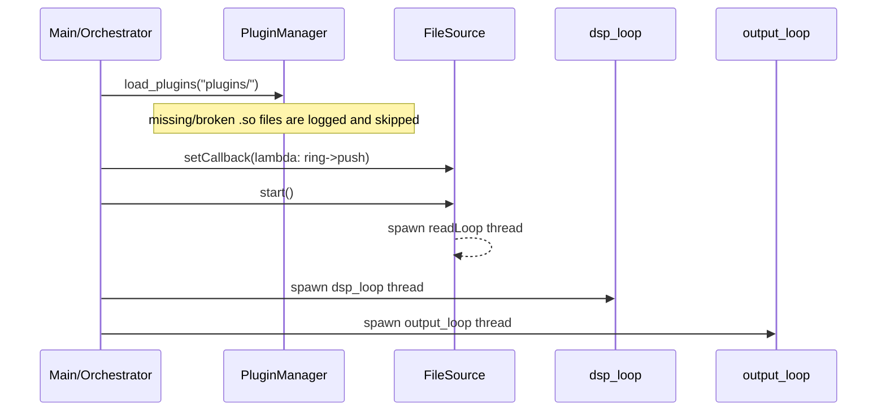
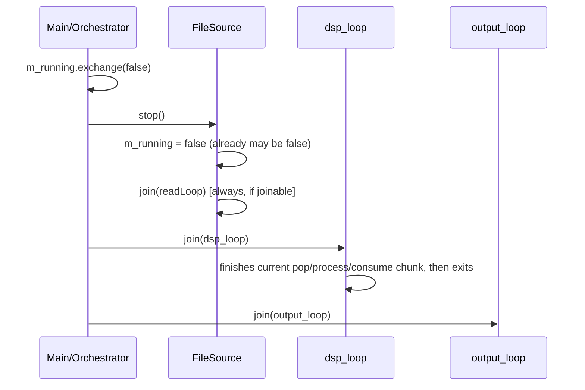

# First Principles: Threading, Orchestration, and Shutdown Sequencing

This document describes the **thread model as actually implemented** in `src/core/Orchestrator.cpp`, `src/ingress/FileSource.cpp`, and the ring buffer — including lifecycle state machines, the shutdown sequence, and a post-mortem of the join-contract bug that the current code fixes.

## 1. Thread Inventory

| Thread | Created by | Loop body | Exit condition |
|---|---|---|---|
| Main (orchestrator) | process start | `start()` → wait → `stop()` | returns from `main` |
| Ingress worker | `FileSource::start()` (`src/ingress/FileSource.cpp:21`) | read chunk → normalize uint8→float → `callback()` (= `ring->push`) → `yield()` | EOF, read error, or `m_running == false` |
| DSP | `Orchestrator::start()` (`src/core/Orchestrator.cpp:36`) | `pop()` → `process()` (FIR) → `consume()`; `yield()` when idle | `m_running == false` |
| Output (**stub**) | `Orchestrator::start()` (`src/core/Orchestrator.cpp:37`) | `sleep_for(10ms)` — decoders are loaded but not yet wired here | `m_running == false` |

All three worker loops poll an `std::atomic<bool>` (`m_running`) with acquire loads; none block on condition variables. The idle strategy is `std::this_thread::yield()`, which keeps latency low at the cost of some CPU while data is starved.

## 2. Startup Sequence



Details that matter:

- **Guard first**: `start()` begins with `if (m_running.exchange(true)) return false;` — double-start is a no-op returning `false`.
- **Fail fast**: if no source was configured, the flag is reset and `start()` returns `false` before any thread exists.
- **Plugin scan is CWD-relative**: `"plugins/"` resolves against the process working directory, not the executable location.
- **Callback wiring happens before thread spawn**, so there is no race on an unset callback for the first chunk.

## 3. Shutdown Sequence



Ordering rationale:

1. **Ingress stops first** so no new data enters the ring buffer after shutdown begins.
2. **DSP joins next** — it observes the flag between chunks and exits without draining samples still buffered (documented limitation: buffered samples at shutdown are dropped).
3. **Output joins last** because it will eventually consume decoder output; stopping it last avoids tearing down a consumer that downstream stages might still address.

`stop()` is idempotent (`exchange(false)` gate) and `~Orchestrator()` calls `stop()`, so destruction always terminates threads.

## 4. The Join Contract — A Bug Post-Mortem

The original `FileSource::stop()` gated the join on the atomic exchange:

```cpp
// BUGGY VERSION — do not restore
void FileSource::stop() {
    if (m_running.exchange(false)) {      // false if readLoop already exited!
        if (m_workerThread.joinable()) {
            m_workerThread.join();
        }
    }
}
```

Why it crashed: `readLoop()` clears `m_running = false` itself when it reaches EOF (`src/ingress/FileSource.cpp`). For any file small enough to finish reading before `stop()` is called — i.e., every test fixture and the benchmark file — the exchange returned `false`, the join was skipped, and the still-joinable `std::thread` object then called `std::terminate()` from `~FileSource` during stack unwinding.

Failure signature observed under lldb:

```
libc++abi: terminating
frame #7 std::__1::thread::~thread()
frame #8 sdr::FileSource::~FileSource()
frame #9 sdr::Orchestrator::~Orchestrator()
```

It also made `OrchestratorShutdown.DoubleStopSafe` racy: it passed only when the worker had not yet hit EOF at first `stop()`.

The fix restores the real invariant — *the join condition is thread existence, not the run flag*:

```cpp
void FileSource::stop() {
    m_running = false;
    if (m_workerThread.joinable()) {
        m_workerThread.join();
    }
}
```

General rule for every `ISource` implementation (and any RAII thread owner):

> `joinable()` is the only valid precondition for `join()`. Run flags track *work availability*, not *thread existence* — never derive one from the other.

## 5. Memory Ordering Usage Map

Every atomic access in the hot path and its justification:

| Location | Access | Ordering | Reason |
|---|---|---|---|
| `SpscRingBuffer::push` (`src/buffer/SpscRingBuffer.cpp:23`) | own `head` load | relaxed | only this thread writes head |
| `SpscRingBuffer::push` | `tail` load | acquire | see consumer's published consumes before claiming space |
| `SpscRingBuffer::push` | `head` store | release | publish data written by the copy above |
| `SpscRingBuffer::pop` | `head` load | acquire | see producer's published data before reading it |
| `SpscRingBuffer::pop` | own `tail` load | relaxed | only this thread writes tail |
| `SpscRingBuffer::consume` | `tail` store | release | publish freed space to producer |
| `Orchestrator` / `FileSource` loops | `m_running` loads | acquire | observe stop signal promptly |
| `Orchestrator::start/stop` | `m_running` exchange | seq_cst (default) | lifecycle transitions are rare; default is fine |

## 6. Known Limitations & Roadmap

1. **No drain-on-stop**: samples still in the ring buffer when the flag drops are discarded. A production pipeline would drain bounded remaining data before joining DSP.
2. **Output stage is a stub**: decoders register via `PluginManager` but `dsp_loop` does not yet hand filtered samples to them, and `output_loop` sleeps. Roadmap: second SPSC queue (decoded packets) + telemetry formatting.
3. **No thread priorities**: LLD allows optional `SCHED_FIFO`; nothing sets scheduling policy today.
4. **Busy-yield idle**: `yield()` loops burn CPU under starvation; acceptable for the demo, replaceable with an eventcount/futex later without changing contracts.
5. **Fixed ring capacity**: 8192 complex samples hard-coded in the `Orchestrator` constructor.
