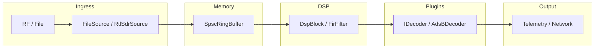

# SDR Protocol Stack — First Principles Index

This folder explains the core concepts behind the SDR pipeline from first principles, assuming staff-level C++ and embedded systems knowledge.

## Documents

1. [`01_iq_sampling.md`](01_iq_sampling.md) — RF downconversion, complex baseband (`I + jQ`), and 8-bit normalization.
2. [`02_ring_buffer.md`](02_ring_buffer.md) — Lock-free SPSC queues, memory ordering (`release`/`acquire`), false sharing, and bitmask indexing.
3. [`03_dsp_fir.md`](03_dsp_fir.md) — FIR convolution, scalar vs AVX2 SIMD, alignment requirements.
4. [`04_plugin_arch.md`](04_plugin_arch.md) — Dynamic linking with `dlopen()`, factory exports, decoder lifecycle.

## Integrated Pipeline (Mermaid)

## Cross-Reference to Implementation

- `include/ISource.hpp` / `src/ingress/FileSource.cpp` → Ingress layer (`01_iq_sampling.md`)
- `include/buffer/SpscRingBuffer.hpp` / `src/buffer/SpscRingBuffer.cpp` → Zero-copy concurrency (`02_ring_buffer.md`)
- `include/dsp/DspBlock.hpp` / `src/dsp/FirFilter.cpp` → DSP pipeline (`03_dsp_fir.md`)
- `include/core/IDecoder.hpp` / `src/core/PluginManager.cpp` → Plugin architecture (`04_plugin_arch.md`)
- `LLD.md` → Full design specification and directory mapping.
